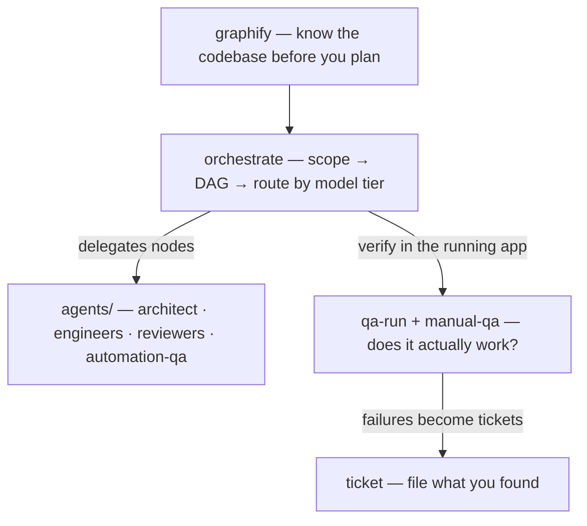

# agent-skills

Agent skills and Claude Code subagents I actually use: a cost-aware **orchestrator**, a crew of **specialist subagents** it routes to, human-style **manual QA** for web and native iOS, a **ticket** writer that produces tickets a human would file, and **graphify** for turning any codebase or corpus into a queryable knowledge graph.

Skills follow the [Agent Skills](https://github.com/anthropics/skills) format (`skills/<name>/SKILL.md`), so they work in Claude Code and any agent that reads the same spec. The subagents in `agents/` are Claude Code-specific.

## What's inside

| Piece | Kind | What it does |
|---|---|---|
| [`orchestrate`](skills/orchestrate/SKILL.md) | skill | Turns a non-trivial task into a parallel task DAG and routes every node to the **cheapest model tier** that can meet its acceptance criteria — strong models plan and review, cheap models grind. Verifies before integrating. When the `agents/` crew is installed it routes nodes to the matching specialist. |
| [`ticket`](skills/ticket/SKILL.md) | skill | Writes human-readable Linear / Jira tickets — repro + where it lives + how to verify, no AI slop. Detects the tracker, remembers team/project per repo, enriches from Figma/Sentry/Slack MCPs when connected. |
| [`qa-run`](skills/qa-run/SKILL.md) | skill | Per-project QA orchestrator: remembers dev URL + login per app, then dispatches the `manual-qa` agent against the running app — web or iOS Simulator. |
| [`playwright-qa`](skills/playwright-qa/SKILL.md) | skill | The browser-driving playbook `manual-qa` follows (navigate → snapshot → act → assert, forced error states, mobile viewports). |
| [`graphify`](skills/graphify/SKILL.md) | skill | Any folder of code/docs/papers/media → persistent knowledge graph with community detection, god nodes, and `query` / `path` / `explain` tools. Wraps the [graphify](https://github.com/sponsors/safishamsi) Python package. |
| [`agents/`](agents/) | subagents | The crew `orchestrate` delegates to: `architect`, `backend-engineer`, `frontend-engineer`, `automation-qa`, `backend-reviewer`, `frontend-reviewer`, `security-reviewer`, and `manual-qa` (drives a real browser or the iOS Simulator; reports PASS/FAIL with evidence). Engineers write code but not tests, the test author writes tests but not code, reviewers only report — that separation is what makes the chain safe to automate. |

## Install

**Claude Code (everything):**

```bash
git clone https://github.com/a-saven/agent-skills.git ~/.agent-skills
bash ~/.agent-skills/install.sh
```

Symlinks each skill into `~/.claude/skills/` and each agent into `~/.claude/agents/`, then a `git pull` updates everything in place. Restart Claude Code once after installing.

**Just the skills, any compatible agent:**

```bash
npx skills add a-saven/agent-skills
```

or copy any `skills/<name>/` folder into wherever your agent loads skills from.

**Per-project config** (never committed): `ticket` stores its tracker mapping in `<repo>/.claude/tickets.local.json`, `qa-run` stores dev URLs + credentials in `<repo>/.claude/qa.local.json` (and gitignores it before writing secrets). Examples in [`templates/`](templates/).

## How the pieces fit



## Requirements

- [Claude Code](https://claude.com/claude-code) and `git` for the full install; skills alone need only an agent that reads `SKILL.md`.
- `qa-run` / `manual-qa`: Node.js for the Playwright MCP (`claude mcp add -s user playwright -- npx @playwright/mcp@latest --headless`); Xcode + Simulator for native iOS runs.
- `graphify`: Python 3.10+ (`uv tool install graphifyy` or `pip install graphifyy`).
- MCPs (Linear/Jira, Figma, Sentry, Slack, a DB) are all optional — every skill degrades gracefully to whatever is connected.

## Credits

- `ticket`, `qa-run`, `playwright-qa`, and the `agents/` crew are adapted from [unisol1020/ai-tools](https://github.com/unisol1020/ai-tools) by Max — thanks 🙏
- `graphify` (the skill) wraps the [graphifyy](https://pypi.org/project/graphifyy/) package by [safishamsi](https://github.com/safishamsi).
- `orchestrate` is mine.

## Uninstall

```bash
for s in orchestrate ticket qa-run playwright-qa graphify; do rm -f ~/.claude/skills/$s; done
for a in architect backend-engineer frontend-engineer automation-qa backend-reviewer frontend-reviewer security-reviewer manual-qa; do rm -f ~/.claude/agents/$a.md; done
rm -rf ~/.agent-skills
```
