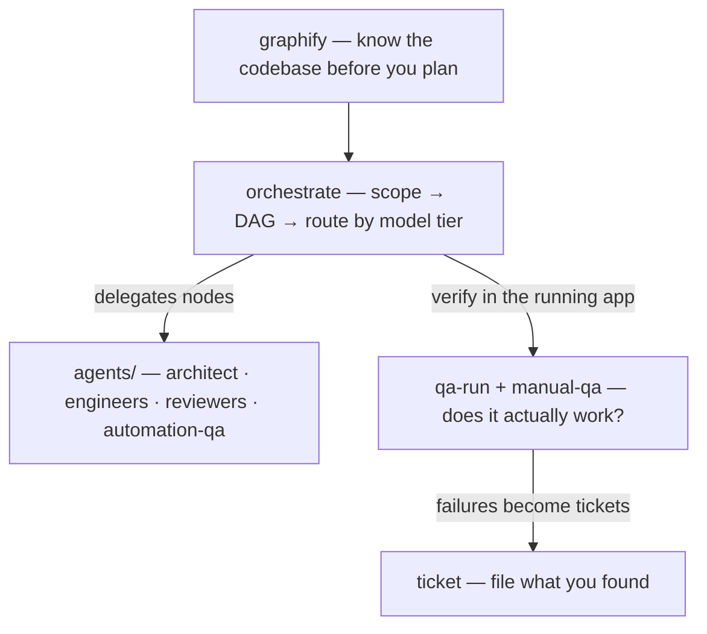

# agent-skills

Agent skills and Claude Code subagents I actually use: a cost-aware **orchestrator**, a crew of **specialist subagents** it routes to, human-style **manual QA** for web and native iOS, a **ticket** writer that produces tickets a human would file, and **graphify** for turning any codebase or corpus into a queryable knowledge graph.

Skills follow the [Agent Skills](https://github.com/anthropics/skills) format (`skills/<name>/SKILL.md`), so they work in Claude Code and any agent that reads the same spec. The subagents in `agents/` are Claude Code-specific.

## What's inside

| Piece | Kind | What it does |
|---|---|---|
| [`orchestrate`](skills/orchestrate/SKILL.md) | skill | Turns a non-trivial task into a parallel task DAG and routes every node to the **cheapest model tier** that can meet its acceptance criteria — strong models plan and review, cheap models grind. Verifies before integrating. When the `agents/` crew is installed it routes nodes to the matching specialist. |
| [`ticket`](skills/ticket/SKILL.md) | skill | Writes human-readable Linear / Jira tickets — repro + where it lives + how to verify, no AI slop. Detects the tracker, remembers team/project per repo, enriches from Figma/Sentry/Slack MCPs when connected. |
| [`qa-run`](skills/qa-run/SKILL.md) | skill | Per-project QA orchestrator: remembers dev URL + login per app, then dispatches the `manual-qa` agent against the running app — web or iOS Simulator. |
| [`playwright-qa`](skills/playwright-qa/SKILL.md) | skill | The browser-driving playbook `manual-qa` follows (navigate → snapshot → act → assert, forced error states, mobile viewports). |
| [`graphify`](skills/graphify/SKILL.md) | skill | Any folder of code/docs/papers/media → persistent knowledge graph with community detection, god nodes, and `query` / `path` / `explain` tools. Wraps the [graphify](https://github.com/sponsors/safishamsi) Python package. |
| [`worktree-graphs`](skills/worktree-graphs/SKILL.md) | skill + [`bin/graphs`](bin/graphs) CLI | Keeps a **CodeGraph index + graphify graph alive in every git worktree** — reflink-clones main's index into fresh worktrees (3 copies of a 251 MB db = 8 KB) and syncs the branch delta, so sessions there never silently fall back to grep. `graphs status` shows one row per worktree. CodeGraph and graphify are complementary: CodeGraph is the branch-accurate "where is X / who calls X" index; graphify is the architectural overview. |
| [`skill-eval`](skills/skill-eval/SKILL.md) | skill + [`bin/skill-eval`](bin/skill-eval) CLI | Regression-tests skills against fixture tasks in `evals/`, scoring mechanical + optionally LLM-judged criteria, and flags drift against a committed baseline. |
| [`agents/`](agents/) | subagents | The crew `orchestrate` delegates to: `architect`, `backend-engineer`, `frontend-engineer`, `automation-qa`, `backend-reviewer`, `frontend-reviewer`, `security-reviewer`, and `manual-qa` (drives a real browser or the iOS Simulator; reports PASS/FAIL with evidence). Engineers write code but not tests, the test author writes tests but not code, reviewers only report — that separation is what makes the chain safe to automate. |

## Install

**Claude Code (everything):**

```bash
git clone https://github.com/a-saven/agent-skills.git ~/.agent-skills
bash ~/.agent-skills/install.sh
```

Symlinks each skill into `~/.claude/skills/` and each agent into `~/.claude/agents/`, then a `git pull` updates everything in place. Restart Claude Code once after installing.

**Just the skills, any compatible agent:**

```bash
npx skills add a-saven/agent-skills
```

or copy any `skills/<name>/` folder into wherever your agent loads skills from.

**Per-project config** (never committed): `ticket` stores its tracker mapping in `<repo>/.claude/tickets.local.json`, `qa-run` stores dev URLs + credentials in `<repo>/.claude/qa.local.json` (and gitignores it before writing secrets). Examples in [`templates/`](templates/).

## How the pieces fit



## Evals

Regression fixtures live in [`evals/`](evals/). Each case is a folder with `task.md` (the prompt) and `criteria.yaml` (binary checks). Run everything with `bin/skill-eval`; filter with `--skill` / `--case`. Mechanical checks run locally; criteria marked `type: judged` use a cheap LLM call and are labeled as such in the report.

```bash
bin/skill-eval                                    # all cases
bin/skill-eval --skill orchestrate --case 01-simple-feature
bin/skill-eval --update-baseline                # promote a good run → evals/results/baseline.json (committed)
```

Timestamped runs land in `evals/results/<ISO-timestamp>-<pid>.json` (gitignored scratch) and include a truncated transcript. **`evals/results/baseline.json` is committed** — `--update-baseline` merges by case-id and refuses a failing run. CI: `bin/skill-eval` (exit 1 on check failure/regression; exit 2 on infra). Skills only — agent evals require the Task tool and are not supported in v1. Invocations time out after `SKILL_EVAL_TIMEOUT` (default 300s; judged checks default 60s). The skill under test is copied from the working tree and loaded via `CLAUDE_CONFIG_DIR` so `~/.claude/skills` cannot shadow it.

**Add a case:** create `evals/<skill>/<case-id>/task.md` + `criteria.yaml`, run the case, then `--update-baseline` if the output is correct.

**Self-test (stub claude, no API):** `bin/skill-eval-selftest` — exercises worktree isolation, timeouts, baseline merge/refuse, and all three shipped cases.

## Requirements

- [Claude Code](https://claude.com/claude-code) and `git` for the full install; skills alone need only an agent that reads `SKILL.md`.
- `skill-eval`: `claude` CLI on PATH with headless (`-p`) mode; `python3` for YAML/JSON parsing and invocation timeouts in [`bin/skill-eval`](bin/skill-eval) (no `yq` dependency).
- `qa-run` / `manual-qa`: Node.js for the Playwright MCP (`claude mcp add -s user playwright -- npx @playwright/mcp@latest --headless`); Xcode + Simulator for native iOS runs.
- `graphify`: Python 3.10+ (`uv tool install graphifyy` or `pip install graphifyy`).
- `worktree-graphs`: the CodeGraph CLI (`npm i -g @colbymchenry/codegraph`, then `codegraph init` once per repo; `codegraph install -y` wires its MCP into Claude Code). The installer also adds a SessionStart hook that runs `graphs ensure` so fresh worktrees seed themselves.
- MCPs (Linear/Jira, Figma, Sentry, Slack, a DB) are all optional — every skill degrades gracefully to whatever is connected.

## Recommended companions

Skills from other collections that pair well with this set — linked, not vendored; read a skill before installing it (a skill is instructions your agent will follow):

| Skill | Source | Why |
|---|---|---|
| `mcp-builder` | [anthropics/skills](https://github.com/anthropics/skills/tree/main/skills/mcp-builder) (Apache-2.0) | Building MCP servers properly — tool design, auth, transports. |
| `sentry-workflow` / `sentry-fix-issues` | [getsentry/sentry-for-ai](https://github.com/getsentry/sentry-for-ai) (MIT) | Sentry-native triage-and-fix against live issues; alert plumbing into Slack/PagerDuty. |
| `webapp-testing` | [anthropics/skills](https://github.com/anthropics/skills/tree/main/skills/webapp-testing) (Apache-2.0) | Scripted Playwright test flows — the automated sibling of `qa-run`'s manual pass. |
| `linear`, `gh-fix-ci`, `notion-spec-to-implementation` | [openai/skills](https://github.com/openai/skills) (per-skill LICENSE, mostly Apache-2.0) | Linear workflow hygiene, CI-failure forensics, Notion spec → implementation plan. Plain spec-conformant SKILL.md — loads in Claude Code unmodified. |
| `app-store-connect-skill` | [199-biotechnologies/app-store-connect-skill](https://github.com/199-biotechnologies/app-store-connect-skill) (MIT) | TestFlight tester/group management and releases from the terminal. Low-star personal repo — review before trusting it with ASC keys. |
| `xcuitest-skill`, `api-skill` | [LambdaTest/agent-skills](https://github.com/LambdaTest/agent-skills) (MIT) | Generate XCUITest suites for iOS; design/mock/test REST APIs. |
| `static-analysis` | [trailofbits/skills](https://github.com/trailofbits/skills) (CC-BY-SA) | CodeQL/Semgrep orchestration from a top security firm. Copyleft — use, don't redistribute. |

Browse more: [agentskills.io](https://agentskills.io) (the spec + client list), [VoltAgent/awesome-agent-skills](https://github.com/VoltAgent/awesome-agent-skills), [hesreallyhim/awesome-claude-code](https://github.com/hesreallyhim/awesome-claude-code).

## Credits

- `ticket`, `qa-run`, `playwright-qa`, `worktree-graphs` + `graphs`, and the `agents/` crew are adapted from [unisol1020/ai-tools](https://github.com/unisol1020/ai-tools) by Max, who I build this stack with — thanks 🙏
- `graphify` (the skill) wraps the [graphifyy](https://pypi.org/project/graphifyy/) package by [safishamsi](https://github.com/safishamsi).
- `orchestrate` is mine.

## Uninstall

```bash
for s in orchestrate ticket qa-run playwright-qa graphify worktree-graphs skill-eval; do rm -f ~/.claude/skills/$s; done
rm -f ~/.claude/bin/graphs ~/.local/bin/graphs ~/.claude/bin/skill-eval ~/.local/bin/skill-eval   # plus the SessionStart "graphs ensure" hook in ~/.claude/settings.json
for a in architect backend-engineer frontend-engineer automation-qa backend-reviewer frontend-reviewer security-reviewer manual-qa; do rm -f ~/.claude/agents/$a.md; done
rm -rf ~/.agent-skills
```
