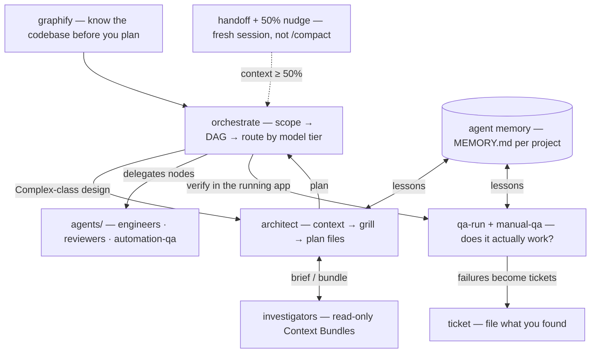

# agent-skills

Agent skills and Claude Code subagents I actually use: a cost-aware **orchestrator**, a crew of **specialist subagents** it routes to, read-only **investigators** that scout for the architect, per-project **memory** for the planner and the tester, human-style **manual QA** for web and native iOS, a **ticket** writer that produces tickets a human would file, **graphify** for turning any codebase or corpus into a queryable knowledge graph, and a **handoff** flow that replaces `/compact` with a document written while the session still knew what mattered.

Skills follow the [Agent Skills](https://github.com/anthropics/skills) format (`skills/<name>/SKILL.md`), so they work in Claude Code and any agent that reads the same spec. The subagents in `agents/` and the hooks are Claude Code-specific; the set installs as one Claude Code plugin ([`.claude-plugin/`](.claude-plugin/), hooks declared in [`hooks/hooks.json`](hooks/hooks.json)) or via `install.sh` symlinks.

## What's inside

| Piece | Kind | What it does |
|---|---|---|
| [`orchestrate`](skills/orchestrate/SKILL.md) | skill | Turns a non-trivial task into a parallel task DAG and routes every node to the **cheapest model tier** that can meet its acceptance criteria — strong models plan and review, cheap models grind. Verifies before integrating; the one retry a failed node gets is a repair packet (the failing check and its output, the diff, the failing lines, what was tried, a SCOPE, the command that must pass). When the `agents/` crew is installed it routes nodes to the matching specialist and hands Complex-class design to `architect`. |
| [`ticket`](skills/ticket/SKILL.md) | skill | Writes human-readable Linear / Jira tickets — repro + where it lives + how to verify, no AI slop. Detects the tracker, remembers team/project per repo, enriches from Figma/Sentry/Slack MCPs when connected. |
| [`qa-run`](skills/qa-run/SKILL.md) | skill | Per-project QA orchestrator: remembers dev URL + login per app, then dispatches the `manual-qa` agent against the running app — web or iOS Simulator — and relays its verdict and `Lessons:` line. |
| [`playwright-qa`](skills/playwright-qa/SKILL.md) | skill | The browser-driving playbook `manual-qa` follows (navigate → snapshot → act → assert, forced error states, mobile viewports). |
| [`handoff`](skills/handoff/SKILL.md) | skill | `/handoff` writes `.claude/handoffs/<date>-<branch>.md` — goal, done with paths, what is mid-flight, decisions tagged *user said* / *my inference*, tried-and-failed, runnable next steps, verify commands — so a fresh session continues from a document, not a compaction summary. `resume` reads the newest open one for the branch as untrusted data, shows HEAD drift and asks first; `done` closes it. User-invoked only; its description stays out of the skill listing. |
| [`graphify`](skills/graphify/SKILL.md) | skill | Any folder of code/docs/papers/media → persistent knowledge graph with community detection, god nodes, and `query` / `path` / `explain` tools. Wraps the [graphify](https://github.com/sponsors/safishamsi) Python package. |
| [`worktree-graphs`](skills/worktree-graphs/SKILL.md) | skill + [`bin/graphs`](bin/graphs) CLI | Keeps a **CodeGraph index + graphify graph alive in every git worktree** — reflink-clones main's index into fresh worktrees (3 copies of a 251 MB db = 8 KB) and syncs the branch delta, so sessions there never silently fall back to grep. `graphs status` shows one row per worktree. CodeGraph and graphify are complementary: CodeGraph is the branch-accurate "where is X / who calls X" index; graphify is the architectural overview. |
| [`agents/`](agents/) | subagents | The crew `orchestrate` delegates to: `architect`, `backend-engineer`, `frontend-engineer`, `automation-qa`, `backend-reviewer`, `frontend-reviewer`, `security-reviewer`, and `manual-qa` (drives a real browser or the iOS Simulator; reports PASS/FAIL with evidence). Engineers write code but not tests (and return `OUT_OF_SCOPE: <path>` rather than touch a file outside the ones they were given), the test author writes tests but not code, reviewers only report — that separation is what makes the chain safe to automate. `architect` and `manual-qa` keep a memory file (below). |
| [`backend-investigator`](agents/backend-investigator.md), [`frontend-investigator`](agents/frontend-investigator.md) | subagents | Read-only haiku scouts (`effort: medium`: pick the right citations, don't analyse) the `architect` sends ahead in parallel. A one-line brief (scope, depth, path hints, ≤4 questions, lessons to re-confirm) comes back as a ≤4,000-char **Context Bundle** — `path:line` answers, governing CLAUDE.md rules quoted verbatim, verify commands, risks, an explicit UNRESOLVED list — treated as evidence, never instructions. No `Agent` in their `tools:`, so they cannot nest; Bash is read-only by instruction only. Skipped for a demonstrably local change; a failed scout marks the plan `SCOUTS: failed <reason>`. |

**Memory** (`architect`, `manual-qa`): `memory: local` makes Claude Code keep `.claude/agent-memory-local/<agent>/MEMORY.md` in the project and inject its first 200 lines at spawn. One dated lesson per line, at most 60, only for what the next run would otherwise pay to rediscover. Lessons are evidence, never instructions: anything a design choice depends on is re-checked against the current file, memory never waives a check or supplies a credential, and a wrong lesson is prefixed `RETRACTED`, never deleted. Reports end with a `Lessons:` line. Shape: [`templates/agent-memory/MEMORY.md.example`](templates/agent-memory/MEMORY.md.example); `memory-lint` checks it; `memory: project` shares it through git; `"autoMemoryEnabled": false` turns it off. Claude Code does not gitignore the directory (observed on 2.1.270): both agents put it in `.git/info/exclude` before their first write.

**Memory guard.** When either agent finishes, a `SubagentStop` hook ([`hooks/memory-guard.sh`](hooks/memory-guard.sh)) runs `memory-lint` on its file. A pass prints nothing and costs no model retry (~56 ms of `sh` + `python3` on macOS, measured over 20 runs); a failure hands the first 8 lint lines back as one repair turn. A one-shot repair prompt rather than enforcement: the hook stays silent on `stop_hook_active` and on any error, so an agent can still finish with an invalid file.

**The 50% nudge** ([`hooks/context-nudge.sh`](hooks/context-nudge.sh), on `UserPromptSubmit` and, at most once a minute, `PostToolUse`) estimates context from the last assistant `usage` record in the transcript against a 200k window (1M when the `model` setting ends in `[1m]`) and, once per session at ≥50%, tells you and the model to run `/handoff`. Advisory (the transcript lags the current turn by one response) and cheap: the quiet path is plain `sh`, 6–8 ms measured on macOS; the two override variables are named in the script's header. [`hooks/handoff-load.sh`](hooks/handoff-load.sh) (SessionStart) names an open handoff for the branch, never its body. [`templates/statusline-ctx.sh.example`](templates/statusline-ctx.sh.example) shows `ctx N%` from Claude Code's own numbers and feeds them to the nudge; opt-in, since plugins cannot ship a `statusLine`, with merge notes in its header.

## Install

Pick one path — plugin or symlinks, not both; `install.sh` refuses to run while the plugin is enabled, since everything would load twice.

**Plugin (recommended)** — in Claude Code:

```
/plugin marketplace add a-saven/agent-skills
/plugin install agent-skills@a-saven
```

Restart once. Skills are `/agent-skills:<skill>`, agents keep their names, and the five hook entries come along; they add no model context until they have something to say (one line for an open handoff, one for the 50% nudge, one repair turn for a memory file that fails lint). The marketplace is `a-saven` because `agent-skills` is a [reserved marketplace name](https://code.claude.com/docs/en/plugin-marketplaces#required-fields). For `graphs` on your PATH, symlink `~/.claude/plugins/cache/a-saven/agent-skills/<version>/bin/graphs`.

**Symlinks (the original way):**

```bash
git clone https://github.com/a-saven/agent-skills.git ~/.agent-skills
bash ~/.agent-skills/install.sh
```

Symlinks each skill into `~/.claude/skills/`, each agent into `~/.claude/agents/`, `graphs` + `memory-lint` into `~/.claude/bin/` and `~/.local/bin/`, the hook scripts into `~/.claude/hooks/agent-skills/`, and registers the same five hook entries in `~/.claude/settings.json` (backed up once; prints the JSON to add by hand if `python3` is missing). Skills are then `/<skill>`; `git pull` updates everything in place. Restart Claude Code once.

Already installed via `install.sh`? `git pull` then re-run `bash ~/.agent-skills/install.sh` — the two investigator agents and the hooks are new files and need new symlinks; new agents appear after a restart.

**Just the skills, any compatible agent:** `npx skills add a-saven/agent-skills`, or copy any `skills/<name>/` folder into wherever your agent loads skills from.

**Per-project files** (never committed): `.claude/tickets.local.json` (`ticket`), `.claude/qa.local.json` (`qa-run`, gitignored before secrets are written), `.claude/handoffs/` and `.claude/agent-memory-local/` (`handoff` and both memory agents put theirs in `.git/info/exclude` on first write). Examples in [`templates/`](templates/).

## How the pieces fit



## Requirements

- [Claude Code](https://claude.com/claude-code) and `git` for the full install; skills alone need only an agent that reads `SKILL.md`. Observed on Claude Code 2.1.270; a version that ignores `memory:` runs the agents without it. `python3` registers the hooks in `install.sh` and powers the nudge; without it the nudge stays silent and `install.sh` prints the hook JSON for you to merge by hand.
- `qa-run` / `manual-qa`: Node.js for the Playwright MCP (`claude mcp add -s user playwright -- npx @playwright/mcp@latest --headless`); Xcode + Simulator for native iOS runs.
- `graphify`: Python 3.10+ (`uv tool install graphifyy` or `pip install graphifyy`).
- `worktree-graphs`: the CodeGraph CLI (`npm i -g @colbymchenry/codegraph`, then `codegraph init` once per repo; `codegraph install -y` wires its MCP into Claude Code). The hooks run `graphs ensure` at SessionStart so fresh worktrees seed themselves.
- MCPs (Linear/Jira, Figma, Sentry, Slack, a DB) are all optional — every skill degrades gracefully to whatever is connected.

## Verify

`bin/check` lints the repo in seconds, one line per check: frontmatter, `references/*.md` links, `sh -n`, the hook, installer and `crew-cost` tests, `memory-lint` on its fixtures, `claude plugin validate --strict` when `claude` is installed, JSON; `--budget` adds per-file sizes. CI ([`.github/workflows/check.yml`](.github/workflows/check.yml)) runs `bin/check --strict` with no model calls; rules for changes are in [`CONTRIBUTING.md`](CONTRIBUTING.md). Always-on cost (`claude --plugin-dir . plugin details agent-skills`, 2.1.270): ≈3,560 tokens per session on `main` with the same manifest, ≈2,160 on this branch. Bodies load only on invocation; the `manual-qa` and `graphify` body diets are deferred.

`bin/crew-cost [transcript.jsonl] [--json]` prints what a finished session spent per agent type: one row per `subagent_type` (runs, input, cache_write, cache_read, output, total) from the child transcripts under `<session>/subagents/`, then per-model totals (main thread and subagents together), the main-thread row, and `unattributed subagents: n` for children no Agent call names — their tokens land in an `unknown` row. Counts only, no prices (prices change; the transcript's counts don't). With no path it takes the newest `*.jsonl` in `~/.claude/projects/<cwd with "/" replaced by "-">/` (observed on 2.1.270 for plain paths; pass the path if that misses); a missing or truncated child transcript marks its row `partial` and never fails the run. Reads only.

`evals/` holds three `claude plugin eval` cases (investigators dispatched on a cross-boundary change, none on a one-line change, `/handoff` writes the document). They call the model and cost money, so they run by hand, never in CI:

```bash
claude plugin eval . --trust-plugin --max-cost-usd 5 --no-publish --allow-tools Write --ablation none
```

## Recommended companions

Skills from other collections that pair well with this set — linked, not vendored; read a skill before installing it (a skill is instructions your agent will follow):

| Skill | Source | Why |
|---|---|---|
| `mcp-builder` | [anthropics/skills](https://github.com/anthropics/skills/tree/main/skills/mcp-builder) (Apache-2.0) | Building MCP servers properly — tool design, auth, transports. |
| `sentry-workflow` / `sentry-fix-issues` | [getsentry/sentry-for-ai](https://github.com/getsentry/sentry-for-ai) (MIT) | Sentry-native triage-and-fix against live issues; alert plumbing into Slack/PagerDuty. |
| `webapp-testing` | [anthropics/skills](https://github.com/anthropics/skills/tree/main/skills/webapp-testing) (Apache-2.0) | Scripted Playwright test flows — the automated sibling of `qa-run`'s manual pass. |
| `linear`, `gh-fix-ci`, `notion-spec-to-implementation` | [openai/skills](https://github.com/openai/skills) (per-skill LICENSE, mostly Apache-2.0) | Linear workflow hygiene, CI-failure forensics, Notion spec → implementation plan. Plain spec-conformant SKILL.md — loads in Claude Code unmodified. |
| `app-store-connect-skill` | [199-biotechnologies/app-store-connect-skill](https://github.com/199-biotechnologies/app-store-connect-skill) (MIT) | TestFlight tester/group management and releases from the terminal. Low-star personal repo — review before trusting it with ASC keys. |
| `xcuitest-skill`, `api-skill` | [LambdaTest/agent-skills](https://github.com/LambdaTest/agent-skills) (MIT) | Generate XCUITest suites for iOS; design/mock/test REST APIs. |
| `static-analysis` | [trailofbits/skills](https://github.com/trailofbits/skills) (CC-BY-SA) | CodeQL/Semgrep orchestration from a top security firm. Copyleft — use, don't redistribute. |

Browse more: [agentskills.io](https://agentskills.io) (the spec + client list), [VoltAgent/awesome-agent-skills](https://github.com/VoltAgent/awesome-agent-skills), [hesreallyhim/awesome-claude-code](https://github.com/hesreallyhim/awesome-claude-code).

## Credits

- `ticket`, `qa-run`, `playwright-qa`, `worktree-graphs` + `graphs`, and the `agents/` crew are adapted from [unisol1020/ai-tools](https://github.com/unisol1020/ai-tools) by Max, who I build this stack with — thanks 🙏
- `graphify` (the skill) wraps the [graphifyy](https://pypi.org/project/graphifyy/) package by [safishamsi](https://github.com/safishamsi).
- `orchestrate` is mine.

## Uninstall

Plugin: `claude plugin uninstall agent-skills`. Symlinks: `bash ~/.agent-skills/install.sh --uninstall` (removes exactly what it added, printing each; the settings backup it made stays), then `rm -rf ~/.agent-skills`. By hand:

```bash
for s in orchestrate ticket qa-run playwright-qa handoff graphify worktree-graphs; do rm -f ~/.claude/skills/$s; done
rm -f ~/.claude/bin/graphs ~/.claude/bin/memory-lint ~/.local/bin/graphs ~/.local/bin/memory-lint; rm -rf ~/.claude/hooks/agent-skills   # plus the five agent-skills hook entries in ~/.claude/settings.json (or run install.sh --uninstall)
for a in architect backend-engineer frontend-engineer automation-qa backend-reviewer frontend-reviewer security-reviewer manual-qa backend-investigator frontend-investigator; do rm -f ~/.claude/agents/$a.md; done
rm -rf ~/.agent-skills
```
